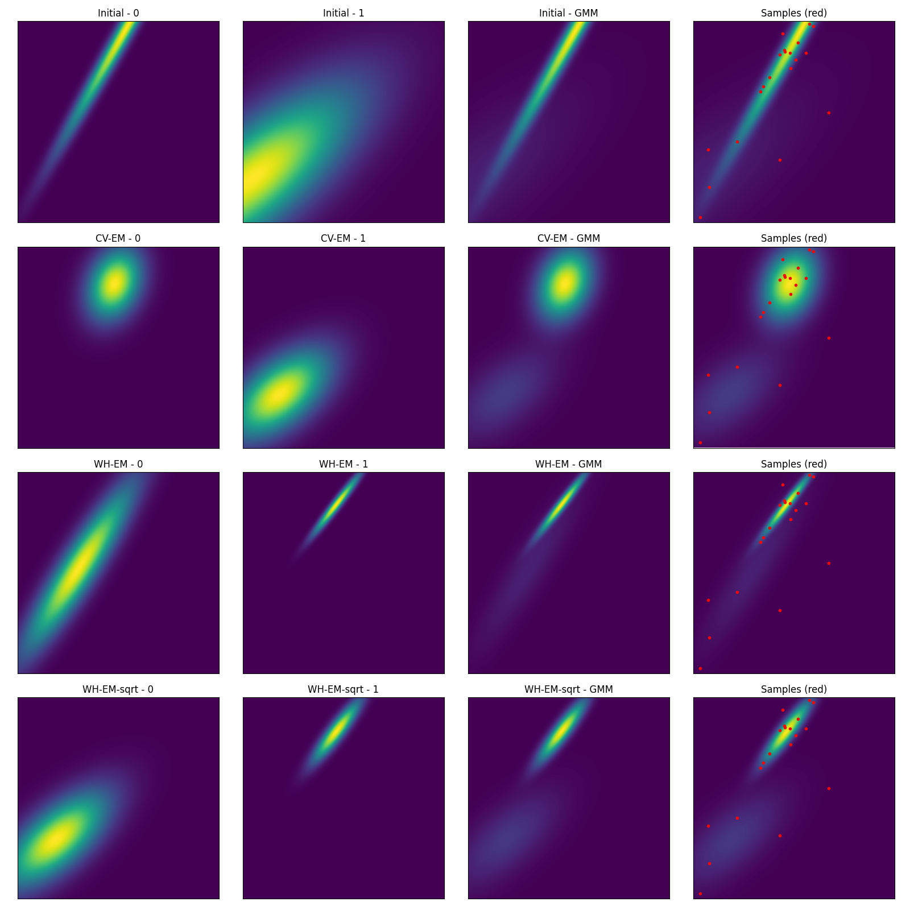

# Weighted Expectation-Maximization for sparse GMM Training

Proof of concept EM-Algorithm implementation that uses
prior knowledge of probabilities on 2D points to train
a multivariate Gaussian Mixture Model (GMM).

## TL;DR
Basically the probability is used for normalization
during the maximization step. 
When the sampling count is low, the square root 
of the probability p can be used instead of p
as an optimization.

The expectation step is not changed:

## Short version
- KMeans with random point initialization
- Low Max-Iterations (default: 5)
- Low count of training points (default: 20).
- Comparison and reference of EM implementation in OpenCV
    - Replication points to add prior probability knowledge to default EM-Algorithm

## What can be observed?
More information is used to approximate the incomplete data.
It shows slightly better results than the reference algorithm,
especially in a sparse sampled environment; without inflating the
sampled data with replicates (less overhead).

#### Example 1
`Initial` is the desired distribution that was used to sample the red dots.
`OpenCV-EM` is the reference algorithm by OpenCV with the sample replication.
`Weighted-EM` is the enhancement by using the probabilities in normalization.

#### Example 2

## Optimizations
On low sampling rate some normals can become faint. 
The square-root on the probability can bring them to the front again.

